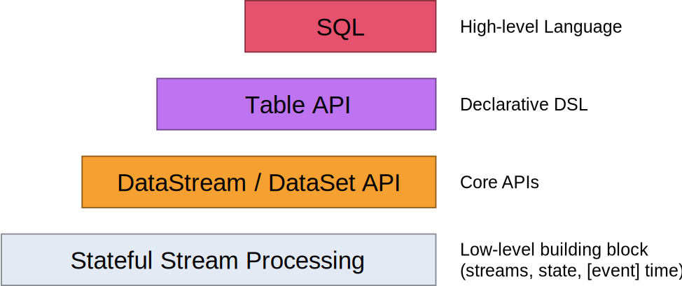

# flink

## Flink中的API
Flink 为流式/批式处理应用程序的开发提供了不同级别的抽象。

* Flink API 最底层的抽象为有状态实时流处理。其抽象实现是 Process Function，并且 Process Function 被 Flink 框架集成到了 DataStream API 中来为我们使用。它允许用户在应用程序中自由地处理来自单流或多流的事件（数据），并提供具有全局一致性和容错保障的状态。此外，用户可以在此层抽象中注册事件时间（event time）和处理时间（processing time）回调方法，从而允许程序可以实现复杂计算。

* Flink API 第二层抽象是 Core APIs。实际上，许多应用程序不需要使用到上述最底层抽象的 API，而是可以使用 Core APIs 进行编程：其中包含 DataStream API（应用于有界/无界数据流场景）。Core APIs 提供的流式 API（Fluent API）为数据处理提供了通用的模块组件，例如各种形式的用户自定义转换（transformations）、联接（joins）、聚合（aggregations）、窗口（windows）和状态（state）操作等。此层 API 中处理的数据类型在每种编程语言中都有其对应的类。

Process Function 这类底层抽象和 DataStream API 的相互集成使得用户可以选择使用更底层的抽象 API 来实现自己的需求。DataSet API 还额外提供了一些原语，比如循环/迭代（loop/iteration）操作。

* Flink API 第三层抽象是 Table API。Table API 是以表（Table）为中心的声明式编程（DSL）API，例如在流式数据场景下，它可以表示一张正在动态改变的表。Table API 遵循（扩展）关系模型：即表拥有 schema（类似于关系型数据库中的 schema），并且 Table API 也提供了类似于关系模型中的操作，比如 select、project、join、group-by 和 aggregate 等。Table API 程序是以声明的方式定义应执行的逻辑操作，而不是确切地指定程序应该执行的代码。尽管 Table API 使用起来很简洁并且可以由各种类型的用户自定义函数扩展功能，但还是比 Core API 的表达能力差。此外，Table API 程序在执行之前还会使用优化器中的优化规则对用户编写的表达式进行优化。

表和 DataStream/DataSet 可以进行无缝切换，Flink 允许用户在编写应用程序时将 Table API 与 DataStream/DataSet API 混合使用。

* Flink API 最顶层抽象是 SQL。这层抽象在语义和程序表达式上都类似于 Table API，但是其程序实现都是 SQL 查询表达式。SQL 抽象与 Table API 抽象之间的关联是非常紧密的，并且 SQL 查询语句可以在 Table API 中定义的表上执行。

## 算子间数据传输的8种策略
* Forward  Forward指上游算子在传输数据给下游算子时采用一对一的模式，即上游算子的一个SubTask只会将数据传输到下游算子的唯一一个SubTask上。
* Rebalance 在Rebalance传输策略下，上游算子会按照轮询模式传输数据给下游算子，即上游算子的一个SubTask会将数据轮询传输到下游算子的每一个SubTask上。轮询算法采用的是Round-Robin负载均衡算法，这种算法会将数据均匀地发送到下游算子的所有SubTask中。
* Shuffle Shuffle传输策略是另一个版本的Rebalance传输策略，Shuffle和Rebalance传输策略都可以做到数据的均匀下发。当算子之间使用Shuffle传输策略，上游算子的SubTask往下游算子的SubTask传输数据时，会随机选择一个下游算子的SubTask进行下发。
* KeyGroup 也称哈希传输策略，当我们使用了KeyBy操作后，上下游算子之间的数据传输策略就是KeyGroup。
* Rescale 在Rescale传输策略下，上游算子会将数据均匀地传输给下游算子，Rebalance传输策略也是均匀分配数据，两者有什么不同呢？和Rebalance不同的地方在于，Rescale不是完全将数据轮询下发到下游算子的所有SubTask上，而是轮询下发到下游算子的一部分SubTask上。
* Broadcast 在Broadcast传输策略下，上游算子会将数据广播下发给下游算子，即上游算子的一个SubTask在往下游算子的SubTask传输数据时，会将每一条数据都下发给下游算子的所有SubTask。
* Global 在Global传输策略下，上游算子会将所有数据下发到下游算子下标为0的SubTask中，即使下游算子的并行度大于1，也只有下标为0的SubTask会收到数据。
* Custom Partition 当上述7种数据传输策略都不能满足需求时，我们还可以自定义数据传输策略，即使用Flink提供的Custom Partition数据传输策略通过自定义的方式将当前数据发送到下游算子指定下标的SubTask中。

## RichFunction
RichFunction 为 Function 扩展了两个重要功能，分别是自定义函数的生命周期和SubTask运行时上下文。

## Flink 三种窗口类型
* 翻滚窗口（又称为”滚动窗口“）TumblingWindow
* 滑动窗口 SlidingWindow
* 会话窗口 SessionWindow
* 全局窗口 GlobalWindow

