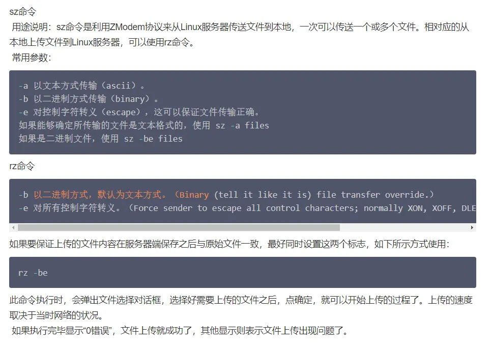

# Linux

## jar
> start /min java -jar xx.jar

## maven
> mvn -B -DskipTests clean install -pl abc123456-gateway -am

## List block devices:
> lsblk -f

## 查看磁盘空间
> df -lh

## 查看文件夹大小
> du -h --max-depth=1

## 通过进程查服务

> netstat -nap | grep 27843

通过端口查进程：

> lsof -i:8080

## 开放端口

> firewall-cmd --zone=public --add-port=8080/tcp --permanent

> firewall-cmd --reload

> firewall-cmd --list-all

## yum安装指定版本 
> yum --showduplicates list PACKAGE | expand

> yum install <package name>-<version info>

## proxy
set:

    export http_proxy=http://127.0.0.1:7890
    export https_proxy=http://127.0.0.1:7890

    export http_proxy=http://192.168.2.28:7890 && export https_proxy=http://192.168.2.28:7890
    export http_proxy=http://192.168.2.40:7890 && export https_proxy=http://192.168.2.40:7890

unset:

    unset http_proxy
    unset https_proxy

## curl不使用代理
> curl http://127.0.0.1:7008/test --noproxy "*"

## lrzsz

## 进入软链接指向的目录
> cd $(readlink -f link-dir)